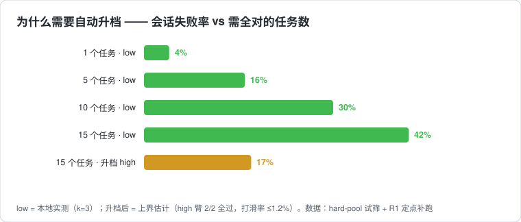
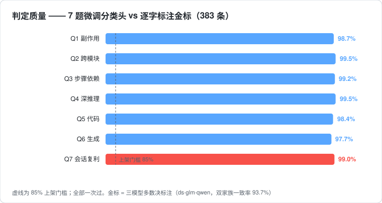
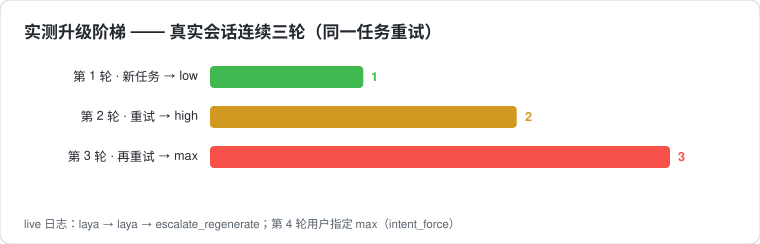

# dsh-router-laya

一个 DSH 插件：对没有明确档位指令的消息，自动选择思考档（low / high / max）。

做法是在本地跑一个微调过的分类模型（842MB，CPU 推理不到 1 秒），配合会话内的检测无感自动升降档。
全程本地离线，超快响应，适配日常使用，从此让Harness开启"自动驾驶"模式。

## 为什么做它——以及为什么值得你试试

你大概也有同感：想让 AI 在难题上多想一会儿，就得手动把档位拉满；而大多数日常消息，
拉满纯属浪费——多烧的 token 换不来更好的回答，来回手动切又麻烦，时间,tokens双双爆炸💥！

关于本插件逻辑的一些理论支持：

- **DeepSeek 的 V3.2 技术报告专门写了这个机制**（thinking budget）：模型训练时就按
  「在给定的思考 token 预算内最大化准确率」来优化，报告里附了不同预算下的性能曲线。
  所谓档位，对应的其实就是这份预算——档位高，能思考的 token 多，消耗也大。
- **OpenAI 的 o3-mini 直接按 low/medium/high 三档发布官方成绩**：低档在多数任务上已经够用，
  高档只在高难任务上拉开差距（[官方公告](https://openai.com/index/o3-mini/)）。
- **《Thoughtology》综述对 R1 系模型的测量**：强模型的准确率随思考预算增长很快饱和，
  大多数任务用不满大预算，多出来的基本是白烧。
- Qwen3 的按请求预算、Anthropic 的 budget_tokens、LangChain 的 reasoning_effort——
  「档位 ≈ 思考 token 预算帽」已经是行业通行的实现。

档位是真实存在的旋钮，问题只剩一个：**谁来判断该拧到几档？** 手动切麻烦，全局拉满浪费。
dsh-router-laya 把这个判断交给一个本地小模型：
它先看一眼你的消息，决定需要多少思考，再把请求路由到合适的档位——你只管发消息。
具体来说：

- **省钱**：简单消息走 low，思考 token 只有拉满时的零头，不再为简单问题支付推理成本
- **快**：低档首字响应更快；本地判定不到 1 秒，无感
- **难事不掉链子**：任务复杂或你在重试时自动升档，max 兜底
- **隐私**：判定模型本地跑，任务文本不出本机
- **越用越准**：判定模型可以随你的使用习惯持续重训

另外我做了 120 多次本地对照实验交叉验证，方向与公开结论一致：单任务 low 档约 96% 成功
（确实不必多花钱）；15 个任务连吃 low 档 42% 翻车、升档后约 17%——这就是这个插件要吃的
那一段：



负责判断的 7 题微调分类头，对金标（三模型交叉标注）一致率 99%、本地判定小于 1 秒：



会话内自动升档的实测阶梯——重试两轮，low 到 max：



输入栏有个档位芯片，实时显示当前档位和最近 20 轮的判断原因；服务离线时变灰并给出启动命令。

## 安装

```bash
npm i -g dsh-router-laya
npx dsh-router-laya setup
```

setup 做三件事：建 Python 虚拟环境、下载 846MB 的 checkpoint（走本仓 GitHub Release，
HF 和镜像做兜底，支持断点续传）、启动判定服务。然后按它打印的 snippet 在你的 DSH profile
里注册插件行，设两个环境变量：

```
ROUTEEXP_ARM=auto
ROUTEEXP_RESPECT_EXPLICIT=1
```

要求：Node ≥ 18，Python ≥ 3.10，约 2GB 磁盘。判定服务需要常驻（setup 会启动，重启机器后
重跑 `npx dsh-router-laya setup` 或 service 里的启动脚本）。

## 它怎么决定档位

按顺序过四层，任何一层命中就停：

1. 词典意图：「用最高档」→ 直接定档（一票否决）；「继续」→ 保持上轮；「别用 max」→ 记一个约束
2. 微调模型：laya接管判定（副作用 / 跨模块 / 步骤依赖 / 深推理 / 代码 / 生成 / 会话复利）→ 规则引擎出档
3. 升级：这轮消息是上一轮的重试 → 沿阶梯升一级
4. 约束过滤：第 1 层记下的约束最后统一执行

失败路径：判定服务不可达 → 落 low，会话不断(概率极低<0.3%)。

## 已知边界

- 判定耗时 1–3 秒，计入每轮首字延迟
- 服务需要常驻进程；DSH 大版本更新可能改动前端注入缝，client.js 需要跟着适配
- 权重下载在国内网络走镜像兜底，首次 846MB

## 数据与复现

README 里的图由 `scripts/make_charts.py`（纯 stdlib）从实测数据生成，CI 会检查图表是否过期。
实验全记录（试筛、判读规则、标注方案、验收数据）在主开发仓
[HapyRain/layaDemo](https://github.com/HapyRain/layaDemo) 的 docs/ 目录。(整理后转公开)

## 写在最后

这个插件目前还在尝试阶段，有不少没做完的地方。当前实现的判断逻辑，针对日常使用是够用的；
如果你要把它用在大项目、高难度任务，或者对识别率有更高要求，建议基于你自己的使用习惯重新
微调一版模型——标注、训练、验收的整条链都是现成的（见上面的数据与复现），换一批你自己的
语料就能重训，本机只要有独立的 GPU 的话几分钟一轮，相当快。

我自己后面有精力的话，也会再用新语料把 Laya 重新微调一版。这次做得比较仓促，见谅。

这本身只是一个小思路。哪里不对、哪里可以更好，欢迎在 GitHub Issues 里提，我都会看。

## License

本项目代码为 Apache-2.0。判定模型基于 [convaiinnovations/laya](https://huggingface.co/convaiinnovations/laya)
与 [answerdotai/ModernBERT-large](https://huggingface.co/answerdotai/ModernBERT-large) 两个
Apache-2.0 项目微调而来，按协议要求在 [NOTICE](./NOTICE) 中署名，在此向两个上游项目致谢。
